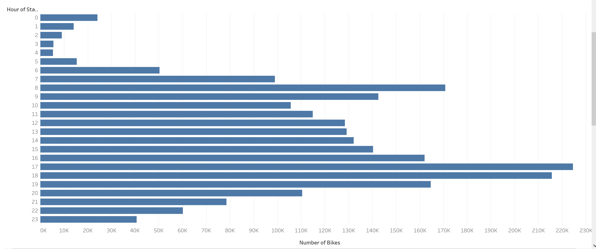
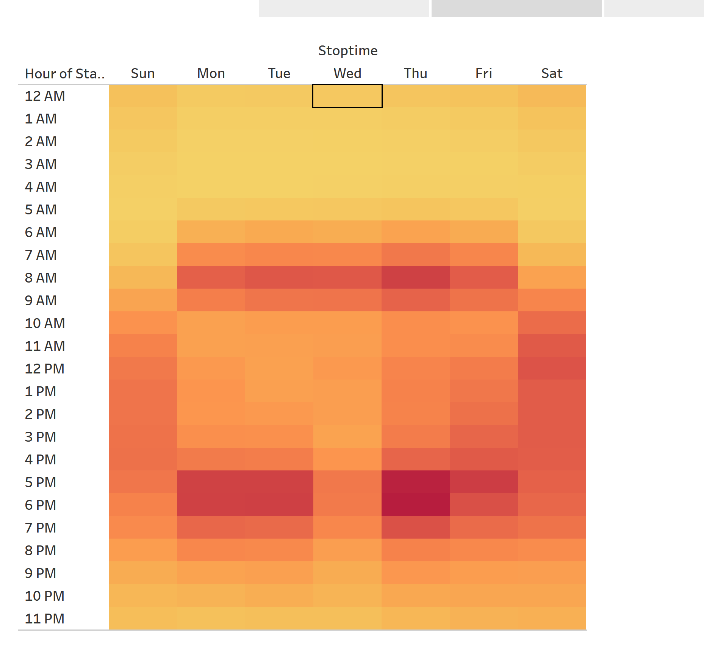
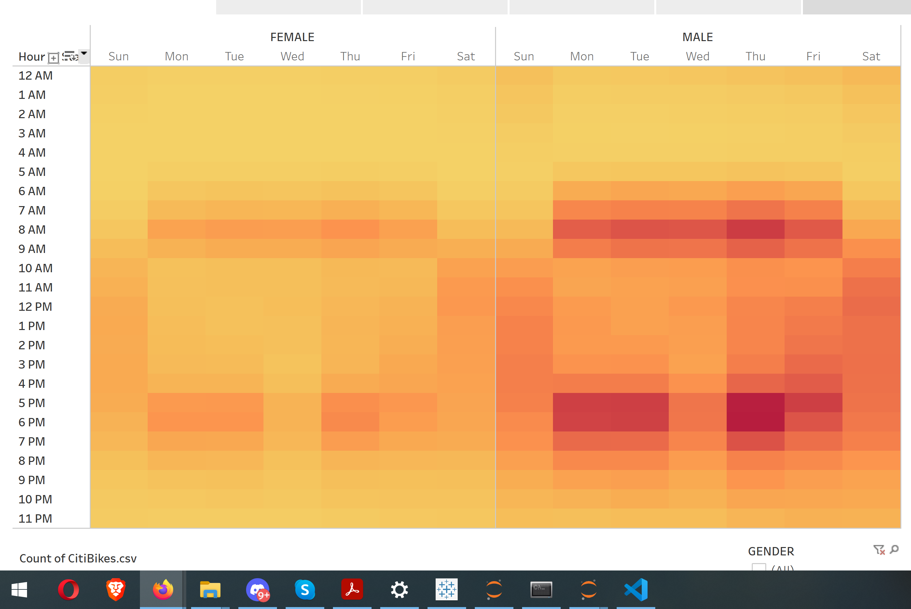
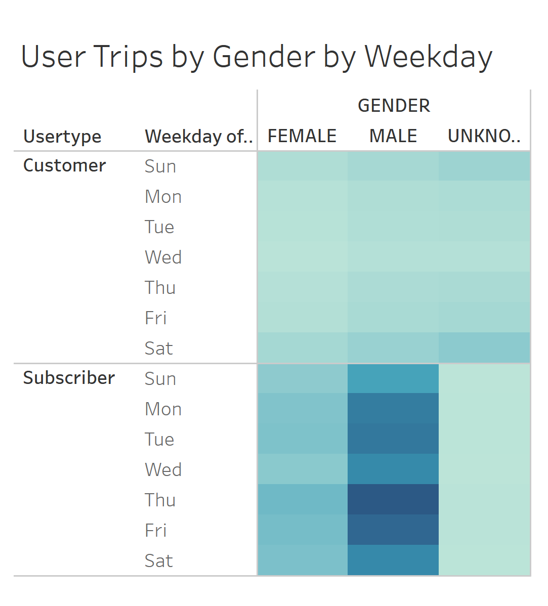
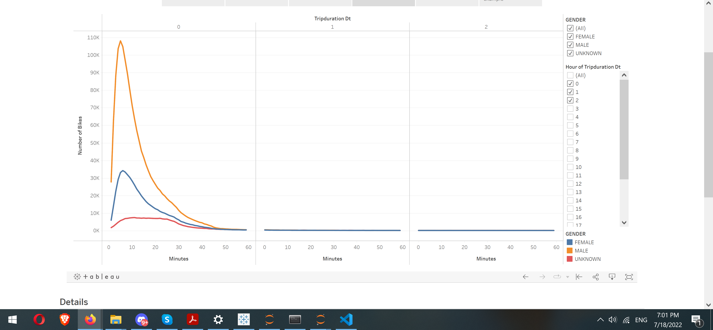
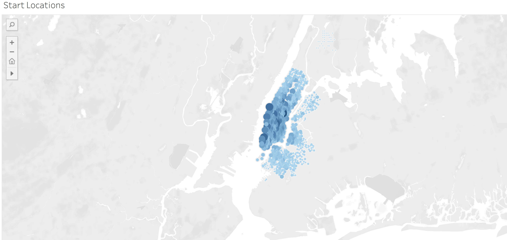
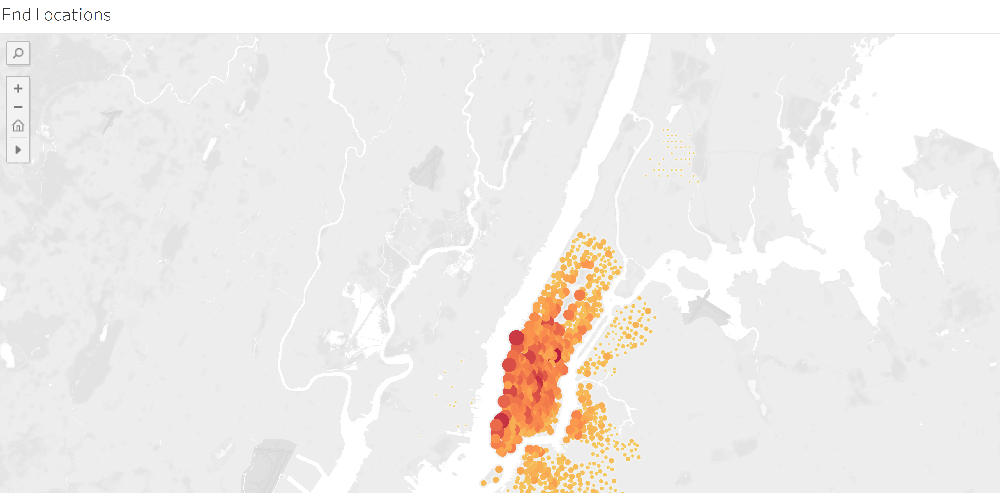
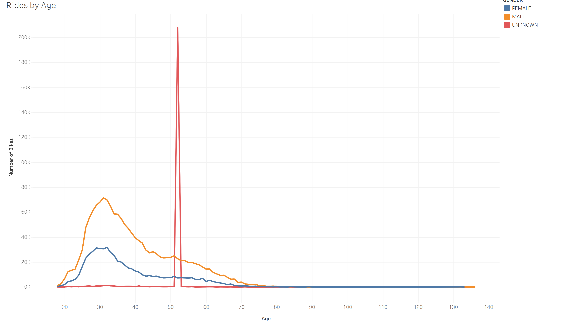

# Bikesharing
Created a story and multiple dashboards using Tableau.

## Overview
[Link to Tableau](https://public.tableau.com/app/profile/mikhail.tikhanchikov/viz/CitiBikeProposal_16581976800830/CheckoutTimesforUsers)

This project is created for potential investors who want to invest in bikesharing. This project visualizes New York City data in August, one of the most profitable months in the year.

## Results

According to data, the most active time is the beginning and the end of working days so people mostly use bikes to commute from home to work and back.

In addition, the heatmap supports previous data but also adds some more information as the popular time at the weekend is afternoon.

As shown on this graph most customers are male subscribers. So, while we have to target mostly male customers it will be a task for marketing to understand how to attract more female customers.

On this graph we can see that mostly bikes are used for short trips under 10 minutes. There are almost no trips longer than 1 hour. For the future development it should be investigated how to increase trip longevity such as EBikes will make it easier to sell long trips.

On this sheet it can be seen that the most popular start locations and end locations are downtown and high trafficking areas where  it’s almost impossible to use a personal vehicle.

In addition, the rade by age is provided. There is outliner data that must be ignored. It can be seen that mostly people aroung 30s use service.

## Conclusion
According to analys
According to analysis, mostly bikes are used for short trips by male subscribers in high traffic areas in the beginning and the end of the day and afternoon at weekends. The analysis shows that bike sharing is extremely popular and has a lot of potential to grow. Definitely, we recommend investing in it. 
For the future investigations we recommend analyzing the following aspects: if additional data is provided what the average subscription time and how often a subscriber uses the service
